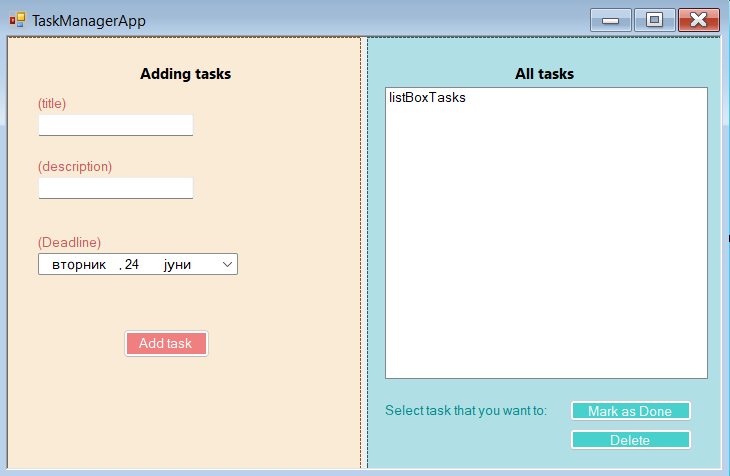

# Task Manager App

A simple desktop application built with C# and WinForms that allows users to manage their daily tasks.

## Features
- Add new tasks (title, description, deadline)
- Mark tasks as completed
- Delete tasks
- Tasks are saved locally in a JSON file

## Technologies
- C#
- WinForms (.NET Framework)
- Newtonsoft.Json for JSON serialization

## Screenshot

## How to Use
1. Open the project in Visual Studio
2. Run the application
3. Add tasks using the form
4. Mark them as completed or delete them when needed
5. Tasks are automatically saved in `tasks.json`

## Author
Radmila Lazarova – [GitHub](https://github.com/radmilalazarova)

## About Me
I'm a computer engineering student passionate about building desktop and web applications.  
Connect with me on [LinkedIn](https://www.linkedin.com/in/radmila-l-a285ab310).

